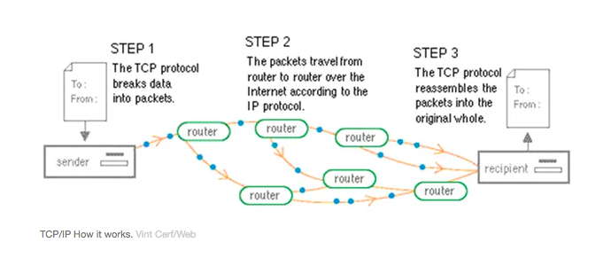
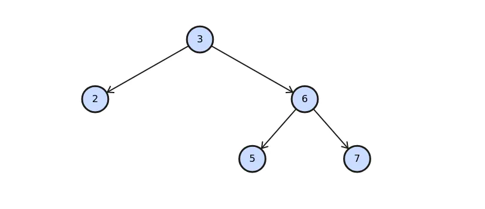
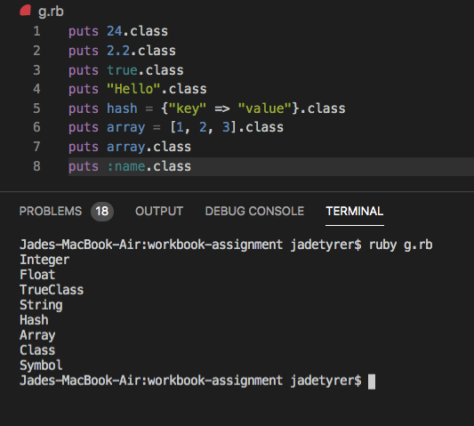

# T1A1 - Workbook 

### Question 1

The earliest form of the internet was known as the ARPANET (The Advanced Research Projects Agency Network). ARPANET was a network of computers that were able to communicate with each other, only these computers knew the protocol to 'talk' to each other. In 1983 a new general protocol was created called TCP/IP (Transfer Control Protocol/Internet Protocol) by Robert Kahn and Vint Cerf. This was a system that created a standard that all computers could use to send and receive information. TCP breaks the message down into packets and reassembles them at the other end. The IP element is concerned with addressing and forwarding the messages to the correct host. 



In 1986 DNS (Domain Name Service) was developed by Paul Mockapetris. DNS enabled users to search for information using domain names such as 'google' as opposed to the IP address numbers. This made it easier to locate the information required on the internet. DNS operates as a directory that matches the domain name with the corresponding IP address. 

In 1990 Tim Bernes-Lee proposed his idea of information sharing, similar to that of ARPANET, to CERN it was entitled  *WorldWideWeb: Proposal for the HyperText Project*. Tim Berners-Lee said *"I just had to take the hypertext idea and connect it to the Transmission Control Protocol and domain name system ideas and—ta-da!—the World Wide Web"*. He created a new standard document format called Hypertext Markup Language (HTML) that would contain in-page links to other related information sources. He also developed the Hyper Text Transfer Protocol (HTTP), this is the way in which requests and responses are sent between hosts. In 2014 HTTPS (secure) was introduced, this ensures that the communication between the browser and server is encrypted and cannot be intercepted by cyber criminals.

In 1993 the first graphical web browser named Mosaic was created. This revolutionised the way the internet was used and made it more widely accessible to the public. The graphical interface coupled with the search engine made using the internet easy for the general public to use and attracted many more people to use the internet. Mosaic's internet traffic grew 341,634% over a year. This paved the way for the modern search engines used today, for example Google that launched in 1998. Google now receives more than 63,000 searches per second. 

In 1995 sites such as Amazon, Ebay and Craigslist went live. This signalled the start of the commercialisation of the internet. Encryption of data on the internet allowed for financial transactions to take place over the internet revolutionising the way that many companies conducted business. Facebook was launched in 2004 sparking the emergence of social media and a new way of advertising products. Social media coupled with e-commerce created an immense new platform for marketing and conducting business. In 2018 2.8 trillion USD was spent online due to these new developments of the internet. 

*Ahmad, I. (2018). A Timeline of the Internet: 1969—2018 (infographic). Retrieved 13 December 2019, from https://www.digitalinformationworld.com/2018/08/history-of-the-internet-infographic.html*

*Topic: E-commerce worldwide. (2019). Retrieved 13 December 2019, from https://www.statista.com/topics/871/online-shopping/*

*63 Fascinating Google Search Statistics (Updated 2019). (2019). Retrieved 13 December 2019, from https://bluelist.co/blog/google-stats-and-facts/*

*What is HTTP. (2019). Retrieved 13 December 2019, from https://www.w3schools.com/whatis/whatis_http.asp*


*Funding a Revolution. (1999). doi: 10.17226/6323, from https://www.nap.edu/read/6323/chapter/9#178*

*How the Internet was born: from the ARPANET to the Internet. (2016). Retrieved 13 December 2019, from https://theconversation.com/how-the-internet-was-born-from-the-arpanet-to-the-internet-68072*


### Question 2

  **Packets**
Packets refer to the way information is sent over the internet. Any piece of information that is sent or requested via the internet is broken down into packets to be delivered. The packets contain the bytes of binary code (usually 1000 to 1500 bytes) relating to the information sent or requested. These packets are sent via the best available network route. The packets of data are reassembled at the other end to reproduce the original information. 

  **IP addresses (IPv4 and IPv6)**
An Internet Protocol (IP) address is a unique identifier for any device connected to a network. IP addresses provide a standardised way for all devices to be identified and ensure information is delivered to the correct host. IPv4 is made up of a 32 bit binary number which allows approximately 4 billion unique identifiers. When it was realised that this would not be enough for the growing number of devices a move towards IPv6 was initiated. IPv6 is a 128 bit binary number providing trillions of unique IP addresses. 

  **Routers and routing**
A router is a device that directs packets of data to the correct IP address. A router will be connected to two or more networks and will direct the packets of information via various network paths and through other routers until it reaches the destination IP address. The router sends the packets along the most efficient network path depending on traffic congestion and other factors. This means not all packets related to the same information will take the same route or arrive at the same time. 

  **Domains and DNS**
A domain name is the name given to identify certain resources on the internet in place of the nondescript numerical IP address. This increases the usability of the internet and makes information more readily accessible. Domain Name System (DNS) is a system for associating domain names with their associated IP address. This way users only need to know the domain name to be able to request information and not the more complicated IP address. DNS is a network of directories that work together to convert all domain names into machine readable IP addresses to direct requests for information to the correct server. 

*Garden, H., HowStuffWorks, Tech, Computer, Hardware, & Networking. (2000). What is a packet?. Retrieved 13 December 2019, from https://computer.howstuffworks.com/question525.htm*

*(2019). Retrieved 13 December 2019, from https://www.guru99.com/difference-ipv4-vs-ipv6.html*

*(2019). Retrieved 13 December 2019, from https://support.microsoft.com/en-au/help/164015/understanding-tcp-ip-addressing-and-subnetting-basics*

*What Is a Router (Residential Gateway) and How Does It Work?. (2019). Retrieved 13 December 2019, from https://www.lifewire.com/what-is-a-router-2618162*

*YouTube. (2019). Retrieved 13 December 2019, from https://www.youtube.com/watch?v=aD_yi5VjF78*

*What is a domain name? - Domain Names - Beginner's Guide | Website.com. (2019). Retrieved 13 December 2019, from https://www.website.com/beginnerguide/domainnames/8/1/What-is-a-domain-name?.ws*

*YouTube. (2019). Retrieved 13 December 2019, from https://www.youtube.com/watch?v=MwxMsaFFycg*


### Question 3

**TCP**
Transmission Internet Protocol (TCP) manages the sending and receiving of packets of data across the internet. TCP defines a set of standards and procedures used universally to determine how data is transmitted across networks. TCP works alongside IP to ensure information sent across the internet is complete and delivered to the correct destination. TCP is responsible for ensuring that all packets of information are received to reproduce the original message reliably. TCP will send out an acknowledgement packet to the sending device if all packets are received. If any of the packets of data go missing or are corrupted on transmission TCP will send a request from the server for the missing packets of data. TCP has enhanced the communication via the internet by providing reliability between the client and server. 

**HTTP and HTTPS**
Hypertext Transfer Protocol (HTTP) is essentially the language that web browsers and servers use to communicate with each other. When asking for certain information, for example a webpage via a browser, a 'GET' request is sent to the server asking for the HTML code file relating to the information. When sending information it is known as a 'POST' request. As the information is being sent on open networks between clients and servers it is vulnerable to interception and manipulation by hackers. HTTPS (secure) was created to deal with this issue. Transport Layer Security (TSL) formerly known as Secure Sockets Layer (SSL) is designed to encrypt all information being exchanged between servers and web browsers. This means all data being sent between the client and server is secure and cannot be intercepted by hackers creating a safer internet environment. 

  **Web browsers**
A web browser is a software application that allows the user to access information from the internet. The browser is run on the client device and communicates with servers via networks to deliver information. When the server is sent a 'GET' request it will send packets of data that make up the requested information, for example a webpage. The browser will then convert the packets of data to the Hypertext Markup Language (HTML), Cascading Style Sheet (CSS) and Java Script (JS) to render the webpage to the screen. 
- HTML: The standardised language used to communicate the structure and layout of a web document, how the web browser will display the information. 
- CSS: The style sheet that describes the presentation of the information for example tables, fonts and colours. 
- JS: A computer programming language that is used to create interactive features in web documents. 

*TCP (Transmission Control Protocol) Explained. (2019). Retrieved 13 December 2019, from https://www.lifewire.com/tcp-transmission-control-protocol-3426736*
*https://www.cloudflare.com/learning/ssl/transport-layer-security-tls/*
*YouTube. (2019). Retrieved 13 December 2019, from https://www.youtube.com/watch?v=1K64fWX5z4U&t=45s*


### Question 4

Three data structures used in Ruby are:

1. Array - An array is an object that contains other objects, essentially it is a list in square brackets separated by commas:
```ruby 
array = [1, 2, 3, 4, 5]
```
Each object in an array corresponds to an integer index starting from 0. Ruby arrays can hold objects such as strings, integers, hashes or other arrays. They allow for storing and organising data to make code more maintainable and readable. Methods can then be used on the array object to manipulate and work with the list of data.

2. Hash - A hash is a collection of data stored in key value pairs. Hashes differ from arrays as the index is related to the key rather than an integer. Hash key value pairs are contained in curly braces and are connected by the rocket syntax:

```ruby 
hash = {"key_1" => "value_1", "key_2" => "value_2"}
```
Hashes are a way of storing related pieces of data and can be looked up by asking for the value of a particular key. Hashes contain objects that can be made up of strings, integers, arrays and other hashes. Hashes are an efficient way of organising and storing related pieces of information within code. 

3. Binary tree - A binary tree is another data structure that can be implemented in Ruby. A binary tree is made up of nodes and is conceptualised as shown below. An example of a binary tree would be a file system that has multiple directories and files, it is a way of organising data into branches.



The top node is known as the root and the nodes below are known as the children nodes. Each node can have two nodes attached. Any node directly above the children nodes is called the parent node and nodes with no children at the bottom of the structure are known as the leaf nodes. Binary trees can be coded in Ruby as below:

```ruby
class BinaryTreeNode
  attr_accessor :value, :left, :right

  def initialize(value)
    @value = value
  end 
end 

root = BinaryTreeNode.new(3)
root.left = BinaryTreeNode.new(2)
root.right = BinaryTreeNode.new(6)
root.right.left = BinaryTreeNode.new(5)
root.right.right = BinaryTreeNode.new(7)
```

https://www.youtube.com/watch?v=YdiICiNHFvA

*Ruby - Arrays - Tutorialspoint. (2019). Retrieved 13 December 2019, from https://www.tutorialspoint.com/ruby/ruby_arrays.htm*

*Ruby - Arrays - Tutorialspoint. (2019). Retrieved 13 December 2019, from https://www.tutorialspoint.com/ruby/ruby_arrays.htm*

*An Overview of Data Structures For Ruby Developers. (2019). Retrieved 13 December 2019, from https://www.rubyguides.com/2019/04/ruby-data-structures/*

*YouTube. (2019). Retrieved 13 December 2019, from https://www.youtube.com/watch?v=YdiICiNHFvA*

### Question 5
###### Compilers and Interpreters

A compiler takes high-level programming language code and converts it into machine readable binary code (also known as object language). This then creates a second executable file that can be sent to any computer to be directly run via the CPU without the need for any other program to run the application. The compiler takes the entire program and generates the object code and then the program can be run as a whole. Any errors in the code will then be displayed together which can make it difficult to debug. As the code is already in the format understood by machines compilers are faster in the execution of the application in comparison to interpreters. Compilers are used with programming languages such as C, C++ and C#.

Interpreters also take high-level programming language but instead of producing an intermediate binary code file it interprets the code, line by line, during execution of the application. When executing code via an interpreter the computer running the application needs to ensure they have an interpreter program. The interpreter compiles the code to machine readable code parallel to the application being executed. This means that any errors in the code will be displayed individually making it easier to rectify any issues in comparison to compilers. As the code is being simultaneously compiled and executed it can take longer for the the application to be executed. Interpreters are used with programming languages such as Ruby, Python and PHP. 


*Interpreter vs Compiler | Top 5 Best Differences (With Infographics). (2018). Retrieved 13 December 2019, from https://www.educba.com/interpreter-vs-compiler/*

*Difference Between Compiler and Interpreter (With Comparison Chart) - Tech Differences. (2017). Retrieved 13 December 2019, from https://techdifferences.com/difference-between-compiler-and-interpreter.html*


### Question 6

###### Ruby
**Advantages**
1. Easy for beginners as it is a high level programming language, a high level of abstraction from the computer hardware.
2. Object orientated programming means it is easier to debug and shorter code due to class inheritance.
3. As it is close to normal language it makes it easier to decipher each others code this increases its maintainability.
4. It is open source so anyone can update the code and there are many gems and plug-ins available for free for additional functionality.


**Disadvantages**
1. Ruby is an interpreted language which means it is slower than complied languages as each line in interpreted when executed. 
2. There is a lack of good documentation. It can be difficult to find information regarding less popular gems. 
3. Ruby has a comparatively small community than more popular languages such as C#. This leads to a lack of books and other materials relating to Ruby.
4. Development of Ruby is slower than other languages meaning bug fixes and updates can take comparatively longer. 

###### C
**Advantages**
1. C is a powerful and robust language that has many different data types and operators that allow for many operations to be performed. 
2. It is compatible with many different machines with very few variations to the code (portability).
3. As C is a middle level programming language it supports low level and high level programming.
4. As it is a compiled language it is much faster in comparison to interpreted languages. 

**Disadvantages**
1. C is a procedural programming language and does not support the useful functions of object orientated programming such as inheritance.
2. It is a compiled language as the code is not executed line by line errors are only shown after writing the program which can make debugging very difficult. 
3. C does not support an exception handling feature, errors cannot be caught and dealt with efficiently. 
4. In C the constructor and destructor features are not available. This is the feature that creates or destroys an object therefore this has to be done manually.

*Advantages and Disadvantages of Ruby on Rails-Hire a ROR Expert Now!. (2016). Retrieved 13 December 2019, from https://businesslabs.org/learning-rooms/advantages-disadvantages-ruby-on-rails/*

*Pros & Cons you must know before using Ruby on Rails for your startup. (2018). Retrieved 13 December 2019, from https://hackernoon.com/pros-cons-you-must-know-before-using-ruby-on-rails-for-your-startup-234ecd631aaf*

*Advantages And Disadvantages Of C Language. (2019). Retrieved 13 December 2019, from https://tekslate.com/advantages-c-language*

*Advantages And Disadvantages Of C Language. (2019). Retrieved 13 December 2019, from https://tekslate.com/advantages-c-language*


### Question 7

**Intellectual property, copyright, and acknowledgement**

The internet has greatly increased the amount of freely available information for anyone using the web. As this information can be easily copied and pasted it raises the issue of digital ownership and copyright. When intellectual property is shared freely on the internet individuals can reuse the information without permission or acknowledgement of the initial creator. An IT professional has an ethical responsibility to ensure the information they are using has the appropriate permission or acknowledgment. 

With regard to developers creating software the law in Australia states that code written is protected by copyright as an original literary work. This means the code is protected as long as it can be proven the work is authentic. The law clearly states to developers that as soon as the code has been written anyone who '*copies/reproduces, adapts or communicates the software*' is in breach of the copyright law. The law is clear in what is admissible which reflects that ethically copying another individual's work without permission is unacceptable. This does not apply to the concept of the software only to the code written, others may write their own code to replicate the purpose of the software.

*Oracle vs Google Case*
Oracle filed a lawsuit against Google in 2010 claiming Google copied their Java API code verbatim. Google claim that Oracle are attempting to claim open-source software used by many developers to create applications that are compatible with each other. An IT professional in this scenario could have used the concept of the code to write their own version of the API to mitigate the risk of copyright infringement. Under Australian law Google could have written their own code to replicate the function of Oracles' software. An ethical IT professional would have not copied the code but attempted to devise their own solution. To prevent ethical breaches IT professionals should ensure that any code they are copying from another source has the appropriate authorisation, or failing this, write their own code to solve the required problem. 


**Aggressive sales and marketing practices designed to mislead and deceive consumers**

The huge shift of marketing to online means IT professionals have an ethical responsibility to protect users from aggressive sales and marketing tactics. A web developer needs to assess whether the marketing techniques implemented are implementing to the webpage are appropriate and not intended to mislead or deceive consumers. The company that has commissioned a web developer to design a webpage for them also possesses ethical responsibility for what they are asking the IT professional to develop. This can make it complex to ascertain where the responsibility lies regarding protecting the consumer. The IT professional implementing the practices need to have an understanding of what the ethical standards are in order to question the tactics they are implementing on behalf of others. IT professionals need to be aware of the issues surrounding aggressive marketing and sales in order to mitigate the risk of engaging in unethical behavior. 

IT professionals have responsibility to ensure the content they are producing is free from aggressive marketing techniques such as implementing advertising disguised as real content or the overuse of advertising covering the content of the page. This type of marketing is deceptive and can be seen to coerce users to click on these ads. 

The Australian Competition and Consumer Commission (ACCC) states '*It is illegal for a business to engage in conduct that misleads or deceives or is likely to mislead or deceive consumers or other businesses*'. This means the IT professional needs to have an awareness of the product being sold and ensure the information they are incorporating is factual. They also need to consider that aggressive forms of advertising could be seen by law as deceptive and misleading. For example, if the advertising is incorporated into the website disguised as genuine content, is not clear that it is marketing a product of service. The ACCC is not clear when it comes to aggressive marketing practices, there doesn't appear to be laws against this. It would be helpful for developers to have a set of guidelines to know what techniques are considered '*aggressive*'. This would enhance understanding of what is acceptable and eliminate any grey area regarding what constitutes consumer deception.

*Copyright for digital products | IP Australia. (2019). Retrieved 13 December 2019, from https://www.ipaustralia.gov.au/ip-for-digital-business/develop/copyright*

*Livni, E. (2019). US Supreme Court holds innovation in the balance in Google v Oracle. Retrieved 13 December 2019, from https://qz.com/1751975/in-google-v-oracle-scotus-holds-innovation-in-the-balance/*

*Inbound versus aggressive marketing - What really works? - Awin. (2018). Retrieved 13 December 2019, from https://www.awin.com/us/affiliate-marketing/inbound-vs-aggressive-marketing*

*Advertising and selling guide - Misleading or deceptive conduct. (2014). Retrieved 13 December 2019, from https://www.accc.gov.au/publications/advertising-selling/advertising-and-selling-guide/avoid-misleading-or-deceptive-claims-or-conduct/misleading-or-deceptive-conduct*

*Ethical Issues in Online Advertising. (2019). Retrieved 13 December 2019, from https://www.thebalancesmb.com/ethical-issues-in-online-advertising-39115*


### Question 8 
**Control Flow**
Control flow is a way of controlling the path of a program. Control flow allows the program to flow through alternative outcomes dependent on given conditions. Conditions are evaluated from top to bottom to determine which direction the program takes. In Ruby these come in two main categories:
- Selection - for branching to different paths of the program
- Repetition - for looping through the program dependent on conditions set

An example of control flow in Ruby is an *if* statement demonstrated below:

```ruby 
x = 1 
if x < 2
    puts ("x is greater less than 2!")
elsif x > 2
    puts ("x is greater than 2!")
else
    puts ("x is equal to 2!")
end 
```
### Question 9
Type coercion is changing an object type from one thing to another. For example changing a string into an integer or changing an integer to a float. In Ruby this is done by using `.to_` syntax. Type coercion is needed as certain objects need to be in a particular format to be manipulated. In the case below the variable `num` relates to a string that needs to be converted to an integer before the total can be calculated as a string cannot be added to an integer. 
```ruby 
num = "3" 
total = num.to_i + 6
puts total
```

### Question 10
Ruby data types include:
- Integer - any whole number
``` ruby 
1, 55, 789
```
- Float - a decimal or floating point number
```ruby
1.0, 65.890, 100.99
```
- Boolean - a true or false value, they differ from the other data types as there is no boolean parent class and are sole instances of `TrueClass` and `FalseClass`
```ruby
true or false
```
- String - an object containing group of characters enclosed in quotations
```ruby
"Hello World", "This is a string", "1, 2, 3, 4"
```
- Hash - an object containing a list of key and value pairs
```ruby 
hash = {
    "key_1" => "value_1",
    "key_2" => "value_2"
}
```
- Array - an object containing a list of objects
```ruby
array = [1, "string", 89.99, [1, 2, 3]]
```
- Symbol - a light-weight (low memory usage) string object starting with a colon
```ruby
:name, :age, :gender
```
Each data type belongs to a class which can be found using the `.class` method on the object as demonstrated below:



*Ruby | Data Types - GeeksforGeeks. (2018). Retrieved 13 December 2019, from https://www.geeksforgeeks.org/ruby-data-types/*


### Question 11
**Restaurant classes**

When using Ruby to build an app to replace the staff in a restaurant classes need to be created to imitate the real life objects. Ruby is an object orientated programming language that is designed to emulate objects from the real world. For this scenario there would need to be a minimum of two classes. There needs to be a customer class that has the attributes of name, table number and payment details. This creates an instance of each customer with their details.

There also needs to be an order class with a menu hash detailing the key as the food or drink item and the value as the price of the item. The order class would need attributes of the selected items from the menu hash and the price total of the items selected. The instance of the customer can then be attributed to corresponding order instance and saved in hash key value pair. 

### Question 12
```ruby
celsius = gets
fahrenheit = (celsius * 9 / 5) + 32
print "The result is: "
print fahrenheit
puts "."
```
The code is unable to execute as the user input `gets` is returned as string. For the calculation `fahrenheit` to take place there needs to be coercion of user input to an integer. The number string is converted to an integer using the syntax `.to_i`. The code can also be shortened and the result interpolated to the final string. The program needs to be corrected to:
```ruby
celsius = gets.to_i
fahrenheit = (celsius * 9 / 5) + 32
puts "The result is: #{fahrenheit}."
```

### Question 13
Rewritten ruby code:
```ruby
arr = [5, 22, 29, 39, 19, 51, 78, 96, 84]
i = 0
while (i < arr.size - 1 and arr[i] < arr[i + 1])
  i = i + 1 
end
arr[i], arr[i + 1] = arr[i + 1], arr[i]

puts arr
```


### Question 14
Below is the flow chart describing the steps to find out if a number is prime:


Below is the pseudocode for finding primes numbers between 1 and 100 and returning these numbers: 
```
1. Repeat this process for every number between 2 and 100 
2. Starting with 2 divide the number by every divisor between 2 the number exclusive
3. If the number has any factors it is not a prime number
4. If there are are remainders in every case then it is a prime number
```

The ruby code:
```ruby
def prime_num(num)
  (2...num).none? {|div| num % div == 0}
end 

prime_array = []
(1..100).each do |num| 
  if prime_num(num) == true 
    prime_array.push(num)
  end 
end 

puts prime_array
```

### Question 15
The ruby code for weather program: 
```ruby
class Weather
  attr_accessor :rain, :temp
  def initialize(rain, temp)
    @rain = rain
    @temp = temp
  end

  def statement
    if rain == true && temp < 15
      puts "It's wet and cold"
    elsif rain == false && temp < 15
      puts "It's not raining but cold"
    elsif rain == false && temp >= 15
      puts "It's warm but not raining"
    else 
      puts "It's warm and raining"
    end 
  end
end 

weather = Weather.new(true, 16)
weather.statement
```

### Question 16
**Allergy Test Program**
```ruby
$allergy_hash = { 
  "eggs" => 1,
  "peanuts" => 2,
  "shellfish" => 4,
  "strawberries" => 8,
  "tomatoes" => 16,
  "chocolate" => 32,
  "pollen" => 64,
  "cats" => 128
}

class Person
  attr_accessor :allergy_score
  def initialize
    @allergy_array = []
  end 

  def allergy_list(allergy_score)
    @allergy_array = []
    $allergy_hash.each do |key, value|
      if allergy_score & value != 0
      @allergy_array.push(key)
      end 
    end 
  @allergy_array
  end 

  def has_allergy(allergen)
    @allergy_array.include?(allergen)
  end 
end 

require "tty-prompt"
person = Person.new
prompt = TTY::Prompt.new

puts "what is your allergy score?"
allergy_score = gets.chomp.to_i
list = person.allergy_list(allergy_score)

response = prompt.select('Would you like to check an item or view entire list?', %w[Check-item Entire-list])
if response == "Entire-list"
  puts "You are allergic to:"
  puts list

else 
  puts "Which allergen would you like to check?"
  allergen = gets.chomp
  if person.has_allergy(allergen)
    puts "You are allergic to #{allergen}."
  else
    puts "You are not allergic to #{allergen}"
  end
end  
```


